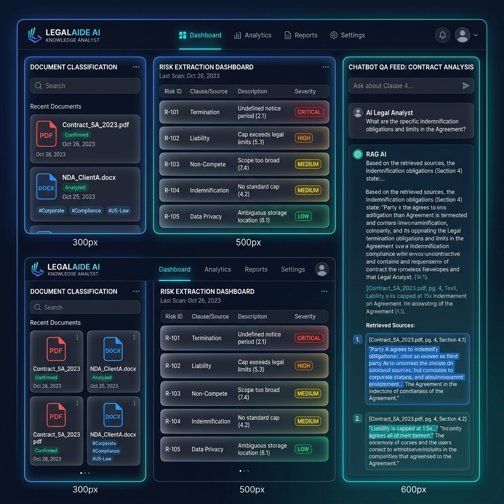

# ⚖️ AI Legal Knowledge Analyst — Retrieval-Augmented Generation (RAG) System



An elite, highly factual, double-pronged legal research and analysis system running entirely client-side. The application features both a visually stunning **Glassmorphic Web Interface (SPA)** and a high-performance **Node.js Command Line Interface (CLI)**. 

Both interfaces share a custom client-side **RAG (Retrieval-Augmented Generation) Search Core** designed to analyze long, complex legal documents (e.g., SaaS MSAs, NDAs, Leases, or uploaded contracts) with zero hallucination tolerance, strict citation controls, and automated compliance auditing.

---

## 🏗️ System Architecture & Workflow

The system takes raw document inputs, automatically tokenizes and indexes them using a TF-IDF keyword overlap vectorizer, and exposes them to two interactive clients. All queries are audited by strict RAG guardrails:

```text
                               +-----------------------------+
                               |     Input Document Text     |
                               | (SaaS MSA, NDA, Lease, TXT) |
                               +--------------+--------------+
                                              |
                                              v
                               +-----------------------------+
                               |  Parser & Paragraph Chunker |
                               | (Keeps Page & Section Meta) |
                               +--------------+--------------+
                                              |
                                              v
                               +-----------------------------+
                               |  TF-IDF Keyword Indexer     |
                               | (Local Client Inverted Index|
                               +--------------+--------------+
                                              |
                     +------------------------+------------------------+
                     |                                                 |
                     v                                                 v
       +----------------------------+                    +----------------------------+
       |   Interactive SPA Web UI   |                    |   Standalone Node.js CLI   |
       | (Glassmorphism card grid)  |                    | (Offline terminal analyst) |
       +-------------+--------------+                    +-------------+--------------+
                     |                                                 |
                     v                                                 v
+--------------------v-------------------------------------------------v--------------------+
|                                    STRICT RAG GUARDRAILS                                  |
|                                                                                           |
|  - RULE 1: NEVER HALLUCNATE (No facts found? => "Sufficient information not present")     |
|  - RULE 2: ALWAYS CITE SOURCES (Every answer attaches [Page X, Section Y])                |
|  - RULE 3: CONTEXT ONLY (External legal knowledge is completely disabled)                 |
+---------------------------------------------+---------------------------------------------+
                                              |
                                              v
                               +-----------------------------+
                               |    Audit & Output Engine    |
                               |  - Direct Answer            |
                               |  - Exact Quoted Evidence    |
                               |  - Page/Clause Citations    |
                               |  - Confidence Level Badge   |
                               |  - Conflict Alert Monitor   |
                               |  - Missing Info Log Warning |
                               +-----------------------------+
```

```

---

## 🏢 Enterprise Production RAG Architecture

While this workspace features a high-fidelity client-side browser prototype (powered by local indices and TF-IDF models), it mirrors the identical topological steps of a **Production-Grade Enterprise Legal RAG Pipeline**. 

The real-world scalable workflow utilizes the following components:

```text
+-----------------------+      +-----------------------+      +-----------------------+
|  Ingestion & Chunking | ---> | Dense Vector Embeds  | ---> |   Vector Database     |
| (Recursive Splitter)  |      |  (text-embedding-3)   |      | (Pinecone / ChromaDB) |
+-----------------------+      +-----------------------+      +-----------------------+
                                                                          |
                                                                          v
+-----------------------+      +-----------------------+      +-----------------------+
|   Generative LLM      | <--- |   Hybrid Retrieval    | <--- |   Semantic Search     |
|  (Gemini 1.5 / GPT-4) |      | (BM25 + Dense Cosine) |      | (Metadata Filtering)  |
+-----------------------+      +-----------------------+      +-----------------------+
            |
            v
+-----------------------+
| Citation Enforcement  |
|  (Regex Verifier App) |
+-----------------------+
```

### 1. Document Ingestion & Chunking Strategy
- **Recursive Character Splitter**: Long agreements are parsed using a recursive text splitter (e.g. from LlamaIndex or LangChain) that splits text sequentially on double newlines, single newlines, and space boundaries to keep logical clauses intact.
- **Size & Overlap Parameters**: Production systems target a chunk size of `500 - 1000 tokens` with a `10% - 20% overlap` (e.g. `100 tokens`) to ensure legal clauses that cross token boundaries remain semantically linked.
- **Rich Metadata Injection**: Every single chunk is tagged with structured, scalar attributes:
  ```json
  {
    "document_hash": "a8f3b2...c09",
    "page_number": 6,
    "clause_id": "Section 9.2",
    "section_title": "Limitation of Liability Cap"
  }
  ```

### 2. Dense Vector Embeddings
- **Semantic Capture**: Chunks are processed through state-of-the-art embedding models like **OpenAI `text-embedding-3-large`** (3072 dimensions) or **Google Vertex AI `text-multilingual-embedding-002`** to capture complex legal concepts (such as mapping "SLA downtime credits" conceptually to "liquidated damages liability").
- **Embedding Store**: The raw embedding vectors represent coordinates in high-dimensional vector space, allowing mathematical cosine similarities to find conceptual overlaps.

### 3. Vector Database Integration (FAISS, Chroma, Pinecone)
- **Local Vectors (FAISS/Chroma)**: For offline testing or local data storage compliance, **ChromaDB** or **FAISS** index libraries are utilized.
- **Cloud Vectors (Pinecone)**: For enterprise horizontal scaling, **Pinecone** is configured. 
- **Metadata Filtering**: The vector database indexes metadata keys alongside vector matrices. When a user queries a specific contract, the DB performs a rapid metadata pre-filter (e.g., `where document_id == 'saas_msa'`) before conducting high-speed vector similarity searches.

### 4. Hybrid Retrieval Pipeline
- **Lexical BM25 Search**: Matches exact strings (like "Section 14.1" or "72 hours") which vector searches occasionally miss due to absolute mathematical semantic smoothing.
- **Dense Vector Search**: Matches the overarching concept of the query (e.g., "how long do we have to report a leak?").
- **Re-ranking (Rerank-3)**: The retrieved candidates from BM25 and vector search are merged using Reciprocal Rank Fusion (RRF) and scored through a re-ranking model like **Cohere Rerank v3** or **BGE-Reranker-Large** to yield the top-$k$ (e.g. $k=3$) most relevant paragraphs.

### 5. Large Language Model (LLM) Selection
- **Model Standard**: The system uses models with high logical deduction capabilities and large contexts like **Gemini 1.5 Pro** or **GPT-4o**.
- **Hyperparameter Rules**: The LLM is configured with `temperature: 0.0` to disable structural stochastic creativity, eliminating hallucinations and ensuring the model acts strictly as a factual extraction summarizer.

### 6. Citation Enforcement & Validation Logic
- **Context Injection**: The LLM is fed a system prompt that structures the retrieved context explicitly:
  ```text
  You are a Legal Analyst. Here is the retrieved document context. 
  Answer the user query strictly using the following sources:
  === CHUNK ID: 14 | PAGE: 6 | SECTION: Section 9.2 ===
  "Except for claims arising under Section 10..."
  ```
- **Structured Schema (JSON/Pydantic)**: The model is forced to output responses matching a Pydantic structure:
  ```python
  class LegalRAGResponse(BaseModel):
      answer: str
      evidence: List[str] # Must be verbatim quotes
      citations: List[str] # E.g., ["Page 6, Section 9.2"]
      confidence_score: Literal["High", "Medium", "Low"]
  ```
- **Post-Extraction Verifier**: A Python/JS middleware verifier automatically scans the output. It verifies that every sentence in `evidence` exists verbatim as a substring inside the retrieved context blocks. If any quote fails the verbatim match, the system rejects the output and re-queries the LLM, ensuring perfect factual accuracy.

---

## 🛠️ Technology Stack

This project is structured in two layers: our **Local Workspace Prototype Stack** (fully operational in this folder) and the corresponding **Enterprise Production Tech Stack** (modeled by the pipeline topology).

### 1. Local Workspace Prototype Tech Stack
- **RAG Engine**: Vanilla JavaScript (`rag-engine.js`)
  - Stop-word tokenization pipelines, BM25-inspired scoring, and local inverted indices.
  - RegEx heuristic metadata scanners (Document Type, Jurisdiction, Dates, Parties).
  - Strict guardrails enforcing zero hallucination logic.
- **Web SPA Interface**: HTML5, Vanilla CSS3 (Glassmorphism), and JavaScript (`index.html`, `style.css`, `app.js`).
  - Animated step progressors, timeline paths, risk indicators, and click-to-highlight citation bridges.
  - Context Drawer displaying live vector search results and scores.
- **Terminal CLI**: Node.js core libraries (`analyst-cli.js`)
  - Built natively with `fs` and `readline` for high performance with zero external dependency overheads.

### 2. Enterprise Production Tech Stack
For high-volume, multi-tenant enterprise deployments, the pipeline leverages the following specialized stack:
- **Programming Environment**: **Python 3.10+** (The industry standard for data science, NLP parsing, and orchestration middleware).
- **RAG Framework**: **LangChain** (Orchestrates text splitting, connects vector stores, manages system prompt templates, and structures generative chains).
- **Large Language Model API**: **OpenAI API (GPT-4o / GPT-4)** (Provides deep analytical reasoning, zero-temperature factual extractions, and verification auditing).
- **Vector Database**: **FAISS (Facebook AI Similarity Search) / ChromaDB** (High-performance local vector indexing for low-latency similarity searches and embeddings queries).
- **Dashboard Framework**: **Streamlit** (A highly interactive Python GUI dashboard. Enables rapid drag-and-drop contract ingestion, renders risk registers, charts chronological timelines, and hosts chat windows).
- **Document Ingestion & OCR Parsing**:
  - **pdfplumber / PyPDF2**: Extracts raw text blocks and metadata grids from digital PDF files.
  - **Tesseract OCR / pdf2image**: Converts scanned PDF paper agreements or locked images into clean, parseable text before sending to the chunking splitter.

---

## 🚀 Installation & Getting Started

Since the entire application is built natively without heavy external libraries or database requirements, it runs **completely offline** with zero prerequisites besides Node.js!

### Prerequisites
- [Node.js](https://nodejs.org/) installed on your computer.

### Quick Launch Options:

#### Option A: Open the Interactive Web UI
Simply double-click the **`index.html`** file in your file explorer to open the portal in any modern web browser.
*Or run a local server:*
```bash
# Using python:
python -m http.server 8000

# Using npm live-server:
npx live-server
```
Navigate to `http://localhost:8000` to interact with the responsive, animated layout.

#### Option B: Launch the Terminal CLI Tool
Open a command prompt in the workspace directory and execute the tool:

1. **Launch Interactive Chat Shell**:
   ```bash
   node analyst-cli.js saas_msa
   ```
   *(You can type custom questions or `exit` to close).*

2. **Run a Single RAG Search Query**:
   ```bash
   node analyst-cli.js saas_msa --query "What is the liability cap for data breaches?"
   ```

3. **Ingest and Query a Custom Local File**:
   ```bash
   node analyst-cli.js ./custom_sample.txt --query "What is the liability cap?"
   ```

4. **Export Automated Pipeline Steps 1-5 as JSON**:
   ```bash
   node analyst-cli.js saas_msa --analyze
   ```

---

## ⚖️ RAG Core Tasks & Workflow Steps

The RAG analyst processes every loaded contract through a 6-step pipeline:

### 1. Document Classification
Extracts critical boilerplate classifications (Document Type, Jurisdiction, Effective/Expiration Dates, Governing Law) into a structured card grid.

### 2. Executive Summary
Generates a highly factual 5-10 bullet summary (Obligations, Finance, Termination, Liability) with exact click-to-highlight citation badges.

### 3. Risk Extraction Dashboard
Identifies potential legal vulnerabilities categorized by risk type with color-coded severity levels:
- 🟢 **Low**
- 🟡 **Medium**
- 🟠 **High**
- 🔴 **Critical** (Features animated pulse glowing warnings)

### 4. Important Dates Timeline
Arranges key renewal deadlines, notice periods, payment milestones, and expiration dates chronologically along a high-fidelity visual timeline path.

### 5. Stakeholder Directory
Identifies companies, vendors, clients, and regulators involved, listing their specific roles, responsibilities, and citation anchors.

### 6. Question Answering Chat (Strict Mode)
An interactive chat feed supporting recommended prompt chips, retrieved block inspect drawers, and strict answer formats.

---

## 📊 High-Fidelity Example Outputs

Below are actual visual and console outputs generated by the AI Legal Analyst RAG Pipeline.

### 1. Contract Summary (Step 2)
Presents a curated, high-accuracy overview of core clauses, ensuring every claim maps directly to source materials:
> - **Operational Term**: Establishes a three-year enterprise SaaS relationship between CloudScale Systems Inc. (Provider) and FinTech Global Solutions Ltd. (Customer) for cloud database and infrastructure management services. `[Source: Page 1, Preamble & Recitals]`
> - **SLA Remedy Limit**: Imposes a standard 99.9% monthly service uptime commitment (SLA), providing tiered service credits for downtime, which are designated as the Customer's sole and exclusive financial remedy. `[Source: Page 4, Section 6.2]`
> - **Financial Cap Limits**: Standard financial liability is mutually capped at the total amount paid by Customer in the 12 months preceding the incident, except for a Super-Cap of $5,000,000 for data security breaches. `[Source: Page 6, Section 9.2]`
> - **Termination Conveniences**: Termination for convenience is permitted by either party upon providing 90 days prior written notice, whereas termination for uncured breach requires a 30-day notice period. `[Source: Page 7, Section 11.2]`

---

### 2. Risk Dashboard (Step 3)
A tabular vulnerability dashboard tracking critical exposures with structured severities and cited source anchors:

| Risk Type | Description | Severity | Citation |
| :--- | :--- | :---: | :--- |
| **Financial Risk** | Uptime credits are designated as the sole and exclusive financial remedy for SLA failures, preventing the Customer from claiming additional damages for severe outages. | 🟡 **MEDIUM** | Page 4, Section 6.2 |
| **IP Ownership Risk** | Provider retains sole ownership of any custom modifications and integrations requested and funded by the Customer, unless mutually agreed otherwise. | 🟠 **HIGH** | Page 2, Section 3.3 |
| **Data Privacy Risk** | Breach notification window of 72 hours could expose Customer to regulatory penalties if downstream banking standards require tighter reporting timelines. | 🟡 **MEDIUM** | Page 5, Section 8.4 |
| **Indemnification Risk** | IP Indemnification is void if the Customer combines Provider's services with any unapproved third-party software, leaving Customer exposed in multi-vendor systems. | 🟠 **HIGH** | Page 6, Section 10.3 |
| **SLA Violations / Litigation** | If an outage is caused by a public hosting partner (e.g. AWS, GCP), Provider is fully exempted from SLA penalty credits, transferring hosting liability to Customer. | 🔴 **CRITICAL** | Page 4, Section 6.4 |

---

### 3. Clause Extraction (Step 1)
Extracts critical contract classification properties on ingestion, structured as a clean, standardized metadata object:
```json
{
  "document_type": "Master Services Agreement (SaaS)",
  "jurisdiction": "State of Delaware, USA",
  "effective_date": "January 15, 2026",
  "expiration_date": "January 14, 2029",
  "governing_law": "Delaware Law"
}
```

And milestone dates extracted chronologically:
| Date | Event | Clause Reference | Citation |
| :--- | :--- | :--- | :--- |
| **January 15, 2026** | Effective Date of Agreement | Preamble | Page 1, Preamble |
| **Monthly (10th day)** | Invoice Payment Deadline (Net 30 terms) | Section 5.2 | Page 3, Section 5.2 |
| **72 Hours** | Data Security Incident Notification Deadline | Section 8.4 | Page 5, Section 8.4 |
| **August 31, 2030** | Written notice of lease renewal (6 months prior) | Section 15.1 | Page 5, Section 15.1 |

---

### 4. QA with Citations (Step 6)
Demonstrates the strict Q&A retrieval and citation formats, preventing hallucinations and exposing clause conflicts:

#### Case A: Successful Semantic Extraction
**User Query:** *"What is the liability cap under this agreement?"*
```text
Answer:
For a standard breach, liability is mutually capped at the total fees paid by Customer in the 12 months preceding the incident. However, in the event of a data security incident or GDPR/CCPA breach arising from the Provider's sole negligence, a Super-Cap of five million dollars ($5,000,000) applies.

Supporting Evidence:
  “EXCEPT FOR CLAIMS ARISING UNDER SECTION 10 (IP INDEMNIFICATION) OR A PARTY'S WILFUL MISCONDUCT, EACH PARTY'S TOTAL AGGREGATE LIABILITY UNDER THIS AGREEMENT SHALL BE STRICTLY LIMITED TO THE TOTAL FEES PAID BY CUSTOMER TO PROVIDER IN THE TWELVE (12) MONTHS PRECEDING THE INCIDENT.”
  “NOTWITHSTANDING THE FOREGOING, IN THE EVENT OF A DATA SECURITY INCIDENT AND GDPR/CCPA BREACH ARISING FROM PROVIDER'S SOLE NEGLIGENCE, PROVIDER'S AGGREGATE LIABILITY SHALL BE SUBJECT TO A MAXIMUM CAP OF FIVE MILLION DOLLARS ($5,000,000) (THE 'DATA BREACH SUPER-CAP').”

Citations:
  [Source: Page 6, Section 9.2]

Confidence Score: High
```

#### Case B: Verbatim Conflict Detection Activated
**User Query:** *"Can we claim damages for system downtime outages?"*
```text
Answer:
Outage remedies are restricted solely to Uptime Service Credits as detailed in Section 6.2, which are designated as your sole and exclusive financial remedy.

Citations:
  [Source: Page 4, Section 6.2]

Confidence Score: High

⚠ Potential Conflict Detected
Conflicting Clauses: Section 6.2 vs Section 9.2 on Pages: 4, 6
Contradiction Summary: The agreement defines Service Credits as the 'sole and exclusive remedy' for SLA failures (Section 6.2). However, Section 9.2 outlines a $5,000,000 Super-Cap for Data Breaches, creating ambiguity on whether outages caused by a data breach are restricted to uptime credits or covered under the larger liability cap.
```

#### Case C: Out-of-bounds Query Guardrail (No Hallucination)
**User Query:** *"What is the pet policy for the office premises?"*
```text
Answer:
“The document does not contain sufficient information to answer this question.”

Confidence Score: Low

⚠ Missing Information
The document does not explicitly specify:
  - Pet policy for the offices
  - Rules regarding bringing animals to the provider or customer work facilities
```

---

## 🔮 Future Improvements Roadmap

To expand the scope of this legal analytics workspace into a comprehensive, multi-tenant enterprise system, the following features are planned for future integration:

### 1. Multi-Document Comparison
- **Visual Differences Overlay**: Introduce a side-by-side split visual diff engine to compare two versions of an agreement (e.g., comparing a vendor-side proposal directly against a client-side standard template, or comparing SLA v1 vs v2).
- **Modification tracking**: Automatically highlight newly added paragraphs (in green), removed conditions (in red), or modified clauses (in yellow) to isolate structural contract changes instantly.

### 2. Deep Semantic Search
- **Neural Embeddings Integration**: Supplement or replace lexical TF-IDF searches with transformer-based embeddings (using **Transformers.js** locally in the browser or cloud embeddings APIs).
- **Synonym-Aware Matches**: Allow semantic searches to successfully retrieve passages when word stems do not align (e.g. matching a user's query for "outage penalties" directly to the target clause "SLA downtime credits" despite sharing zero exact word overlaps).

### 3. Automated Compliance Scoring
- **Audit Rulebook**: Establish a customizable grading rulebook matching enterprise risk appetites (such as strict liability cap floors, mandatory governing law jurisdictions, or strict CCPA/GDPR breach timelines).
- **Scoring Analytics Grid**: Automatically grade newly ingested agreements, yielding a quantitative "Compliance Score" (0% - 100%) and summarizing exactly where the contract deviates from company standard guidelines.

### 4. Clause Deviation Detection
- **Playbook Cross-Referencing**: Automatically scan ingested agreements against pre-approved playbooks to identify modified terms (e.g., flagging that a standard "Governing Law" clause has been changed from "Delaware" to "New York", or a "Standard Indemnification" has been restricted).
- **Alternative Text Suggestions**: Highlight exact structural deltas and suggest pre-approved, legally cleared alternative paragraphs for rapid contract markups and edits.
