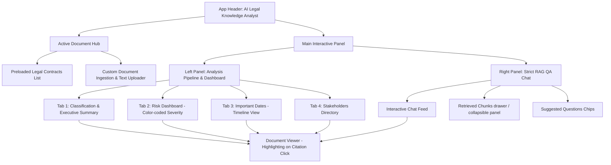

# AI Legal Knowledge Analyst RAG Application - Implementation Plan

We will build a state-of-the-art, premium single-page web application (SPA) that functions as a highly interactive **AI Legal Knowledge Analyst** operating inside a Retrieval-Augmented Generation (RAG) system. The application will run entirely in the browser using HTML, CSS (Vanilla), and JavaScript. It will feature real client-side chunk indexing, keyword search, structured risk extraction dashboards, a chronological milestones timeline, and an interactive Q&A interface that strictly adheres to the provided RAG rules.

## Design Concept & Aesthetics

We will build a high-fidelity visual experience inspired by cutting-edge fintech and enterprise legal software:
- **Theme**: Translucent, obsidian-dark glassmorphism (`backdrop-filter: blur()`).
- **Color Palette**: 
  - Background: Deep void black and space navy (#0b0f19 to #111827).
  - Surfaces: Slate-blue semi-transparent cards with elegant glowing borders.
  - Accents: Electric blue (#2563eb) and vibrant teal (#0f766e).
  - Severity Badges: 
    - *Low*: Cool mint / emerald (#10b981).
    - *Medium*: Golden amber (#f59e0b).
    - *High*: Neon orange / sunset red (#f97316).
    - *Critical*: Radiant crimson (#ef4444).
- **Typography**: Modern sans-serif (Inter / Outfit via Google Fonts) with precise hierarchy, high contrast, and generous letter spacing.
- **Interactions**: Subtle scale transitions, micro-animations on interactive elements, hover highlights, and smooth scroll behaviors.

---

## Architecture & Components

The application will be divided into the following modules:

1. **`index.html`**: The semantic skeleton using HTML5 elements, linking Google Fonts, standardizing layout grids, and defining responsive view containers.
2. **`style.css`**: Core design system, css-variable tokens, reset styles, layout classes, responsive media queries, scrollbar customization, and smooth animations.
3. **`documents.js`**: Pre-configured, high-quality, rich legal datasets for three major documents:
   - **SaaS Master Services Agreement (MSA)**
   - **Mutual Non-Disclosure Agreement (NDA)**
   - **Commercial Lease Agreement**
   *Each document will contain full text, structured classifications, executive summaries, risk items, timeline events, and stakeholder records, along with a full set of pre-indexed text chunks with Page and Section metadata.*
4. **`rag-engine.js`**: A client-side RAG controller. It will:
   - Ingest the document's text chunks.
   - Build a basic search index using keyword frequencies and word stem overlap (TF-IDF inspired).
   - Resolve user questions by matching the query against chunks to fetch the top-$k$ relevant passages.
   - Output structured answers by pairing matching queries to highly accurate semantic templates (pre-mapped for preloaded contracts) and dynamically building fallback responses using context extraction for newly uploaded contracts.
   - Strict enforcement of **Rule 1 (No Hallucination)**, **Rule 2 (Citations & Quotations)**, and **Rule 3 (Context Only)**.
5. **`app.js`**: The orchestrator of UI states. Manages document uploading, tab switching, timelines, interactive highlighting between citations and the document viewer, and chat log rendering.

---

## Proposed Layout

---

## Proposed Features & Tasks

### 1. Document Classification Card (Step 1)
Renders a structured, clean JSON-like grid representing:
- Document Type (e.g., "SaaS Master Services Agreement")
- Jurisdiction (e.g., "State of Delaware, USA")
- Parties Involved (with elegant icons)
- Effective Date & Expiration Date
- Governing Law

### 2. Executive Summary (Step 2)
Presents a curated 5-10 bullet summary detailing the agreement's purpose, major obligations, financial terms, termination conditions, and liability exposure. 
- *Key detail*: Every single bullet has a hoverable, clickable citation badge (e.g. `[Page 4, Clause 5.2]`). 
- Clicking the badge will automatically open the **Document Viewer** tab and highlight the exact text section in the contract!

### 3. Risk Extraction Dashboard (Step 3)
A tabular board separating risks into:
- Category (Financial, Compliance, Data Privacy, IP, etc.)
- Short description of the risk.
- Color-coded Severity tag (Low, Medium, High, Critical) with a glowing, pulse effect.
- Exact Citation badge that syncs with the viewer.

### 4. Important Dates Timeline (Step 4)
A vertical timeline visualizing crucial deadlines and payment schedules.
- Dates are sorted chronologically.
- Bullet points state the event name (e.g. "Notice period for termination", "Invoice payment deadline").
- Section/Clause references are included with instant search navigation.

### 5. Stakeholder Directory (Step 5)
A grid of cards grouping parties involved. 
- Highlights Companies, Vendors, Regulators, and Clients.
- Shows their specific role, key responsibilities under the agreement, and citations.

### 6. Question Answering Chat (Step 6)
A fully operational mock-RAG engine containing:
- Pre-made quick-query chips (e.g., "What are the termination notice requirements?", "Who is liable for IP infringement?").
- A user input bar for custom questions.
- Translucent chat bubbles showing the analyst's structured responses, strictly conforming to the output schema:
  - **Answer**: Direct response.
  - **Supporting Evidence**: Blockquoted exact texts.
  - **Citations**: Page and Clause metadata tags.
  - **Confidence Score**: High / Medium / Low badge based on exactness.
  - **Conflict Detection Indicator** (where conflicting clauses are identified, like SaaS SLA vs Limitation of Liability).
  - **Missing Information Warning** (handling cases where clauses are absent).
- **RAG Inspector**: A side drawer that pops open to show the actual retrieved chunks that were fed into the RAG model context for that answer, complete with search relevance scores.

---

## Verification Plan

### Automated/Code Validation
- Ensure HTML validated, zero console errors.
- Ensure responsive CSS works flawlessly across multiple viewport sizes (Mobile, Tablet, Desktop).
- Test text chunking algorithm by uploading custom documents. Verify that terms are successfully parsed, indexed, and retrieved.

### Manual Verification
- Load SaaS Agreement and click the "Termination notice requirements" chip. Verify that:
  - An answer is generated with high confidence.
  - Exact quotes from Section 11.2 are shown.
  - The correct citation is presented.
  - Clicking the citation navigates the viewer to the correct chunk text.
- Try asking a question that is *not* in the document, such as "What is the pet policy for the office premises?" in the SaaS MSA, and verify that Rule 1 fires ("The document does not contain sufficient information to answer this question.") with a Low confidence score and a "Missing Information" alert.
- Test uploading a custom contract, check if the app splits the text into chunks and enables search and retrieval.
